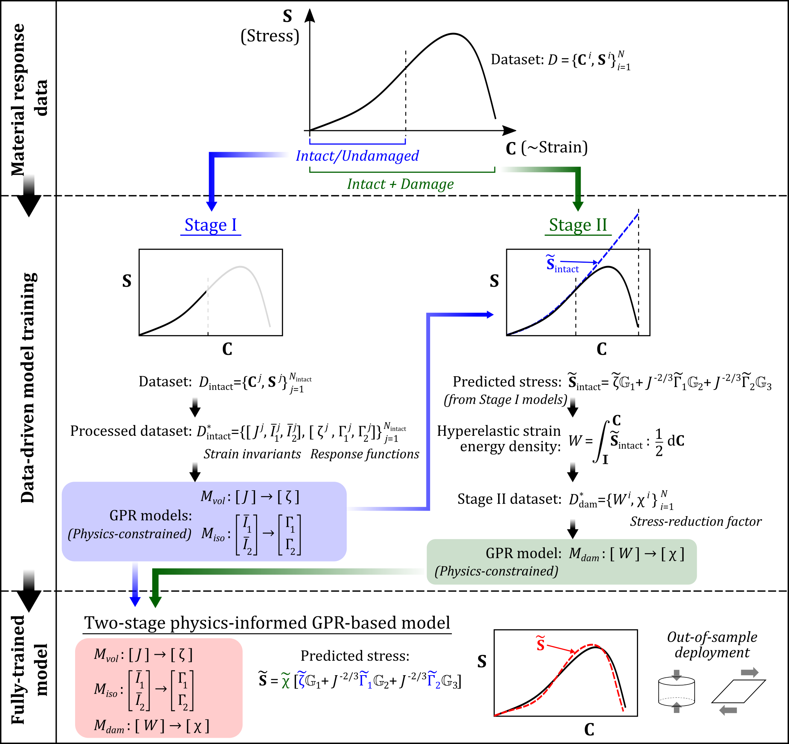

# Hyperelastic Damage Modeling with Physics-Informed GPR

This repository contains the code and data associated with the manuscript:

**Upadhyay, K. (2026). A physics-informed data-driven framework for modeling hyperelastic materials with progressive damage and failure. _Mechanics of Materials_. 218, 105680.** \
<https://doi.org/10.1016/j.mechmat.2026.105680>

<p align="left">
  
</p>

---

## Overview

This repository provides the implementation of a physics-informed, data-driven constitutive modeling framework for hyperelastic materials with progressive damage and failure. The framework uses **Gaussian Process Regression (GPR)** in two stages:

1. **Stage I:** Learn the constitutive response of the undamaged hyperelastic material  
2. **Stage II:** Learn the damage evolution behavior and incorporate it into the final constitutive model  

The framework is developed and validated using **synthetic data**, and then applied to **experimental brain tissue data** digitized from the literature.

The repository is organized to support transparency and reproducibility of the results presented in the paper.

---

## Repository Structure

```text
hyperelastic-damage-gpr/
│
├── data/                  # Experimental datasets (Synthetic datasets are generated directly within the notebook(s))
├── notebooks/             # Jupyter notebooks reproducing paper results
├── src/                   # Reusable Python source files
├── figures/               # Figures used in the README and any static outputs
├── results/               # Saved outputs, exported figures, and model results
├── environment.yml        # Conda environment (general use)
├── requirements_paper.txt # Exact environment used for manuscript results
├── LICENSE                # License file
└── README.md              # Project overview and instructions
```
---

## Contents

This repository will include:

- Jupyter notebooks used to generate results for:
  - model development and validation using synthetic data
  - application to experimental brain tissue datasets  
- associated input datasets  
- reusable Python source code extracted from the notebooks  
- environment specification for reproducibility  
- figures and outputs relevant to the manuscript  

---

## Getting Started

### 1. Clone the repository

```bash
git clone https://github.com/Soft-Materials-Mechanics-Laboratory/hyperelastic-damage-gpr.git
cd hyperelastic-damage-gpr
```
### 2. Setup environment

Two environment options are provided depending on your goal.

🔹 **Option 1: Exact reproduction of manuscript results (Recommended)**

The results reported in the manuscript were generated using the package versions listed in `requirements_paper.txt` with **Python 3.13**.

To reproduce the exact numerical results:
```bash
py -3.13 -m venv venv_paper
venv_paper\Scripts\activate
python -m pip install --upgrade pip
python -m pip install -r requirements_paper.txt
```

🔹 **Option 2: General use (Conda)**
```bash
conda env create -f environment.yml
conda activate hyperelastic-damage-gpr
```

### 3. Run the code
1. Run jupyter
```bash
jupyter lab
```
2. Open notebooks in the `notebooks/` folder.
3. Run notebooks using: Kernel → Restart & Run All

---

## Recommended Workflow

1. Run the synthetic-data notebook(s) first
2. Run the experimental-data notebook(s) next
3. Compare generated figures and outputs with those reported in the manuscript

---

## Data

This repository contains two categories of data:
- **Synthetic Data:** \
  Synthetic datasets are generated directly within the notebook(s) and/or supporting source code used for model development, validation, and demonstration of the framework. This allows users to modify data-generation settings such as parameter ranges, sampling density, and noise levels while preserving reproducibility through documented settings.
- **Experimental Data:** \
  Experimental brain tissue datasets included here were digitized from published literature using WebPlotDigitizer for the purpose of reproducing the analyses in this study.

Please cite the original experimental study when using these data:

G. Franceschini, D. Bigoni, P. Regitnig, G. A. Holzapfel, *Brain tissue deforms similarly to filled elastomers and follows consolidation theory*, *Journal of the Mechanics and Physics of Solids* 54 (12) (2006) 2592–2620. 
doi:10.1016/j.jmps.2006.05.004

## Reproducibility

The goal of this repository is to make the main results of the paper transparent and reproducible.

To ensure reproducibility:
- The exact package versions used in the manuscript are provided in `requirements_paper.txt`
- A Conda environment (`environment.yml`) is provided for general usage
- All notebooks are structured to run end-to-end from a clean kernel
- Reusable code is organized in the `src/` directory
- Input data and generated outputs are separated into dedicated folders

---

## Important Notes

- For exact reproduction of manuscript results, use `requirements_paper.txt`
- Under general use, some numerical differences may occur depending on:
  - package versions (especially scikit-learn, scipy)
  - operating system
  - optimization behavior in GPR
- Always run notebooks using:
  - Restart & Run All

Even when using the exact requirements, minor numerical differences may still arise across platforms due to floating-point arithmetic and backend libraries.

---

## Method Summary

The constitutive modeling framework in this work combines physical structure and machine learning.

At a high level:
- The undamaged hyperelastic response is learned first
- The damage behavior is then learned separately in a second stage
- The final constitutive model combines these two learned components
- The approach is designed to remain physically meaningful while retaining flexibility from data-driven modeling

This structure allows the framework to capture progressive damage and failure while preserving interpretability.

---

## Recommended Citation

Please cite this research as:

```bibtex
@article{UPADHYAY2026105680,
title = {A physics-informed data-driven framework for modeling hyperelastic materials with progressive damage and failure},
journal = {Mechanics of Materials},
volume = {218},
pages = {105680},
year = {2026},
issn = {0167-6636},
doi = {https://doi.org/10.1016/j.mechmat.2026.105680},
url = {https://www.sciencedirect.com/science/article/pii/S0167663626000840},
author = {Kshitiz Upadhyay},
keywords = {Data-driven constitutive models, Hyperelasticity, Damage and failure, Physics-informed machine learning, Gaussian process regression, Soft materials, Brain tissue mechanics},
abstract = {This work presents a two-stage physics-informed, data-driven constitutive modeling framework for hyperelastic soft materials undergoing progressive damage and failure. The framework is grounded in the concept of hyperelasticity with energy limiters and employs Gaussian Process Regression (GPR) to separately learn the intact (undamaged) elastic response and damage evolution directly from data. In Stage I, GPR models learn the intact hyperelastic response through volumetric and isochoric response functions (or only the isochoric response under incompressibility), ensuring energetic consistency of the intact response and satisfaction of fundamental principles such as material frame indifference and balance of angular momentum. In Stage II, damage is modeled via a separate GPR model that learns the mapping between the intact strain energy density predicted by Stage I models and a stress-reduction factor governing damage and failure, with monotonicity, non-negativity, and complete-failure constraints enforced through penalty-based optimization to ensure thermodynamic admissibility. Validation on synthetic datasets, including benchmarking against analytical constitutive models and competing data-driven approaches, demonstrates high in-distribution accuracy under uniaxial tension and robust generalization from limited training data to compression and shear modes not used during training. Application to experimental brain tissue data demonstrates the practical applicability of the framework and enables inference of damage evolution and critical failure energy. Overall, the proposed framework combines the physical consistency, interpretability, and generalizability of analytical models with the flexibility, predictive accuracy, and automation of machine learning, offering a powerful approach for modeling failure in soft materials under limited experimental data. The developed source code, discovered models, and accompanying datasets are available at https://github.com/Soft-Materials-Mechanics-Laboratory/hyperelastic-damage-gpr.}
}
```

---

## License

This repository is released under the MIT License.

See the `LICENSE` file for details.

---

## Author

**Kshitiz Upadhyay, Ph.D.** \
Assistant Professor \
Director of the Soft Materials Mechanics Laboratory \
Department of Aerospace Engineering and Mechanics \
University of Minnesota \
Email: kshitizu@umn.edu

---

## Acknowledgment

This research is based upon work supported by the National Science Foundation under Grant No. 2331294. This repository was created to support open and reproducible research in constitutive modeling, soft material mechanics, and scientific machine learning.
